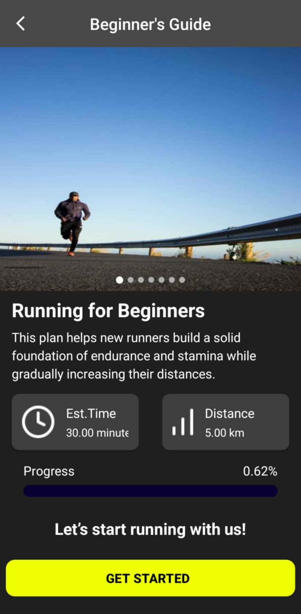

Group Info
=======================

* Group ID: 26
* Project Name: *Tracking Running App*
* Members Info:
    - Đào Thái Sơn - 22BI13392
    - Võ Hồng Quang - 22BI13386
    - Trần Thọ Thăng - 22BI13404
    - Nguyễn Đức Tâm - 22BI13400
    - Vũ Thế Khôi Nguyên - 22BI13344
    - Ngô Quý Đăng Tuấn - 22BI13446

## 🎉 Release v1.0.0 - First Stable Version 🚀

We are excited to announce the official release of **v1.0.0**! This marks the first stable version of the app, featuring full functionality, bug fixes, and performance improvements.

  

    
    
<b>Home</b>

  

  

    
    
<b>Training Plan</b>

  

  

    
    
<b>Run</b>

  

  

    
    
<b>Personal Goal</b>

  

  

    
    
<b>Profile</b>

  

### How to Get Started
1. **Head to the tags** section in the repository.
2. Locate the **APK file** for version v1.0.0.
3. **Download and install** the APK on your device.

We'd love your feedback! Report any issues or suggestions via this Github repository or email me at thaison1939@gmail.com

Thank you for your support, and happy running! 🏃‍♂️

## Update v1.1.0: 
Our app's metrics now achieve **90-95% accuracy** when compared to other leading apps in the industry. For more details, feel free to explore our latest release and install the app through the provided tags.

## App Comparison
Here’s a side-by-side look at our app alongside some of the most popular running apps.

  

    
    
<b>Tracking Running App</b>

  

  

    
    
<b>Strava</b>

  

  

    
    
<b>adidas Running</b>

  

